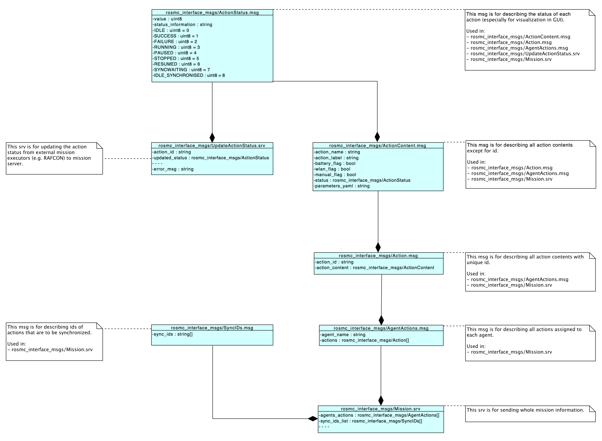

# rosmc_interface_msgs

The is a ROS package for the high-level interfaces between [ROSMC](https://github.com/DLR-RM/rosmc) and robots' [mission_executor](https://github.com/DLR-RM/mission_control_rafcon_statemachines).

This package provides
- ROS messages (in: msg)
- ROS services (in: srv)
- Python scripts to simulate a dummy mission server (in: scripts)

## Interface Overview

Mission is defined as shown in this class diagram.

The following gives an overview of all important topics and services. They have the following format:

"interface description":
* "topic/service name" ("message/service-data-type")

The information flow direction is given by ('source' -> 'target').

### Commands

#### High Level

Mission clients register themselves to mission server so that it can send new missions to them (robots -> ROSMC):
* /mission_control/register_to_mission_server (rosmc_interface_msgs/RegisterToServer.srv)

Mission server send new missions including missions updates to the clients (ROSMC -> robots):
* send_mission (rosmc_interface_msgs/Mission.srv)

Mission server also controls the mission execution (Start, Stop, Pause, Resume) of the clients (ROSMC -> robots):
* trigger_mission_executor (rosmc_interface_msgs/TriggerMissionExecution.srv)

Missions clients send the action status information to the server (robots -> ROSMC):
* /mission_control/update_action_status (rosmc_interface_msgs/UpdateActionStatus.srv)

### Topics  (robots -> ROSMC)
Status per robot:
* status (rosmc_interface_msgs/AgentStatus.msg)
